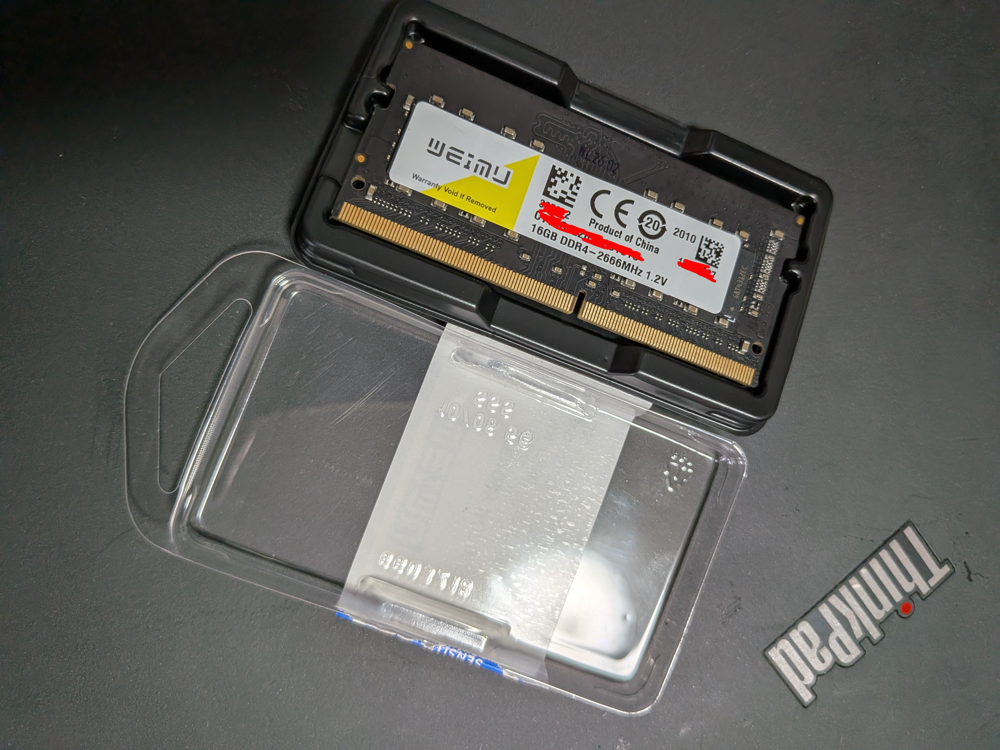
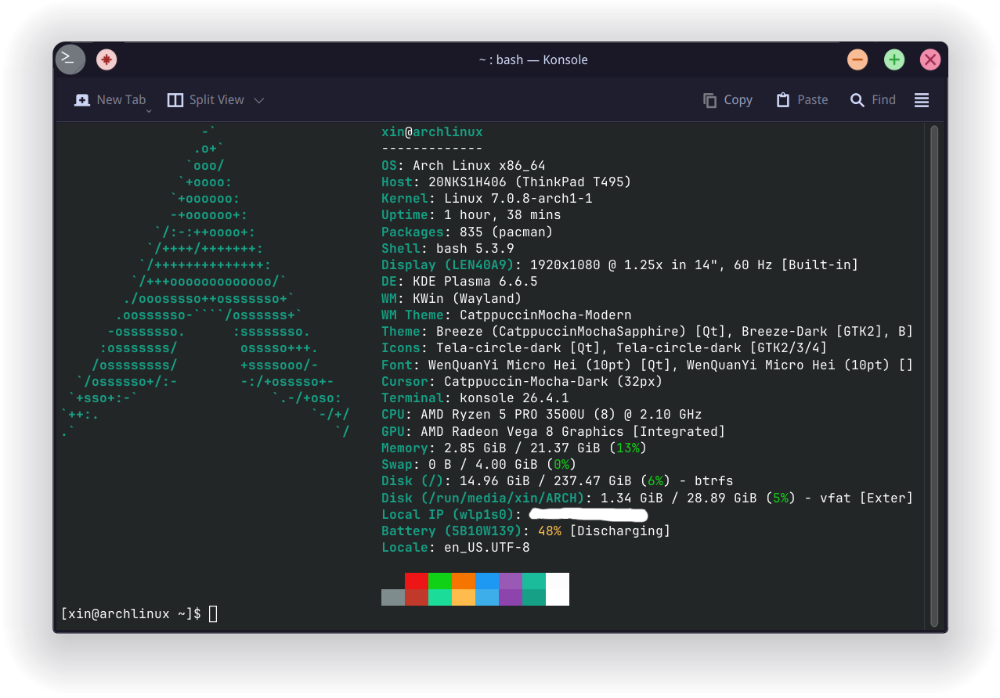

<a id="top"></a>

<div align="center">
  <h1>ThinkPad T495 RAM Upgrade:<br />8 GiB Single‑Channel → 24 GiB Mixed / Flex‑Mode Dual‑Channel</h1>
  <p>
    
    
    
    
    
    
  </p>
  <p><strong>Black slab. Red nub. Dual‑channel dreams.</strong> 🔴🖤</p>
</div>

## Table of Contents
- [Introduction](#introduction)
- [Upgrade Summary](#upgrade-summary)
- [Prerequisites & Tools](#prerequisites--tools)
- [Images](#images)
- [Installation](#installation)
  - [Safety notes](#safety-notes)
- [Before Upgrade](#before-upgrade)
- [After Upgrade (Installed State)](#after-upgrade-installed-state)
- [Benchmarks](#benchmarks)
- [Troubleshooting](#troubleshooting)
- [ThinkPad Culture & Credits](#thinkpad-culture--credits)
- [License](#license)

---

## Introduction
🧠 This repository documents a RAM upgrade on a ThinkPad T495 (Ryzen 3500U): **8 GiB soldered Micron DDR4‑2400** + **one empty SODIMM slot** → **24 GiB physical RAM** with a **16 GiB DDR4 SODIMM**.

## Upgrade Summary

| Item | Before | After |
|---|---:|---:|
| Physical RAM | 8 GiB | 24 GiB |
| Linux usable RAM | 5.7 GiB | 21 GiB |
| Channel A | 8 GiB soldered Micron DDR4‑2400 | 8 GiB soldered Micron DDR4‑2400 |
| Channel B | Empty | 16 GiB DDR4 SODIMM |
| Channel behavior | Single-channel | Mixed / flex-mode dual-channel |
| Reported/configured speed | 2400 MT/s | 2400 MT/s |
| Swap usage at capture | 967 MiB | 0 B |

Notes for nitpickers:
- **8 GiB + 16 GiB is mixed capacity**, so this is not full symmetric dual-channel across all 24 GiB. The matched 8 GiB + 8 GiB portion should benefit from dual-channel behavior; the extra 8 GiB depends on platform/firmware mapping.
- **Linux usable RAM is lower than physical RAM** because the Ryzen Vega iGPU reserves system memory.

Logs captured: `free`, `dmidecode`, `lshw`, and `sysbench` before/after where available.

⬆️ [Back to top](#top)

---

## Prerequisites & Tools
- **Tools:** Phillips #0 screwdriver, spudger, anti‑static wrist strap
- **Reference:** [Lenovo T495 HMM](https://download.lenovo.com/pccbbs/mobiles_pdf/t495_hmm_en.pdf)
- **Software:** `dmidecode`, `lshw`, `sysbench`, `i2c-tools`

⬆️ [Back to top](#top)

---

## Images
Upgrade photos:

| New RAM stick: DDR4 16 GB SODIMM  |
| --- |
|  |

| Empty DIMM slot (before install) |
| --- |
|  |

| New DIMM installed |
| --- |
|  |

| Terminal screenshot (after upgrade) |
| --- |
|  |

⬆️ [Back to top](#top)

---

## Installation
Standard ThinkPad SODIMM swap: disable the battery in BIOS, remove the base cover, and install the module in the free slot next to the soldered memory. Follow the Lenovo HMM for the full procedure.

### Safety notes

- Disable the internal battery in BIOS before opening the laptop.
- Disconnect AC power.
- Use a plastic spudger/opening tool where possible; avoid metal tools around the board.
- Keep track of screws and clips.
- Insert the SODIMM at an angle, then press it down until both side clips lock.
- If anything feels forced, stop and re-check the Lenovo HMM.

⬆️ [Back to top](#top)

---

## Before Upgrade
*Captured on Arch Linux as baseline before installation.*

Raw logs: [logs/before.txt](logs/before.txt)

### System Memory
```bash
$ free -h
               total        used        free      shared  buff/cache   available
Mem:           5.7Gi       3.8Gi       489Mi       294Mi       1.9Gi       1.8Gi
Swap:          2.8Gi       967Mi       1.9Gi
```
*~2 GiB reserved for Vega iGPU, so usable RAM is 5.7 GiB instead of 8 GiB.*

### RAM Details (`dmidecode`)
```text
$ sudo dmidecode -t memory
# dmidecode 3.7
Getting SMBIOS data from sysfs.
SMBIOS 3.1.1 present.

Handle 0x0001, DMI type 16, 23 bytes
Physical Memory Array
	Location: System Board Or Motherboard
	Use: System Memory
	Error Correction Type: None
	Maximum Capacity: 64 GiB
	Error Information Handle: 0x0000
	Number Of Devices: 2

Handle 0x0008, DMI type 17, 40 bytes
Memory Device
	Array Handle: 0x0001
	Error Information Handle: 0x0007
	Total Width: 64 bits
	Data Width: 64 bits
	Size: 8 GiB
	Form Factor: SODIMM
	Set: None
	Locator: DIMM 0
	Bank Locator: P0 CHANNEL A
	Type: DDR4
	Type Detail: Synchronous Unbuffered (Unregistered)
	Speed: 2400 MT/s
	Manufacturer: Micron Technology
	Serial Number: [REDACTED]
	Asset Tag: [REDACTED]
	Part Number: [REDACTED]
	Rank: 1
	Configured Memory Speed: 2400 MT/s
	Minimum Voltage: 1.2 V
	Maximum Voltage: 1.2 V
	Configured Voltage: 1.2 V

Handle 0x000B, DMI type 17, 40 bytes
Memory Device
	Array Handle: 0x0001
	Error Information Handle: 0x000A
	Total Width: Unknown
	Data Width: Unknown
	Size: No Module Installed
	Form Factor: Unknown
	Set: None
	Locator: DIMM 0
	Bank Locator: P0 CHANNEL B
	Type: Unknown
	Type Detail: Unknown
```
- **Channel A:** 8 GiB Micron DDR4‑2400, single‑rank (soldered)
- **Channel B:** empty → **single‑channel operation**
- Board max capacity: 64 GiB

*(Disassembly photos included above.)*

⬆️ [Back to top](#top)

---

## After Upgrade (Installed State)
*Captured on Arch Linux after installing the 16 GiB SODIMM.*

Raw logs: [logs/after.txt](logs/after.txt)

### System Memory
```bash
$ free -h
               total        used        free      shared  buff/cache   available
Mem:            21Gi       3.7Gi        14Gi       143Mi       3.2Gi        17Gi
Swap:          4.0Gi          0B       4.0Gi
```
*Linux now reports 21 GiB usable memory (with hardware-reserved memory taken out).*

### Memory Inventory
```text
$ sudo dmidecode -t memory
...
Handle 0x0008, DMI type 17, 40 bytes
Memory Device
        Size: 8 GiB
        Bank Locator: P0 CHANNEL A
        Type: DDR4
        Speed: 2400 MT/s
        Manufacturer: Micron Technology
        Part Number: [REDACTED]
        Rank: 1
        Configured Memory Speed: 2400 MT/s

Handle 0x000B, DMI type 17, 40 bytes
Memory Device
        Size: 16 GiB
        Bank Locator: P0 CHANNEL B
        Type: DDR4
        Speed: 2400 MT/s
        Manufacturer: Unknown
        Part Number: [REDACTED]
        Rank: 1
        Configured Memory Speed: 2400 MT/s

$ sudo lshw -short -C memory
H/W path              Device          Class          Description
================================================================
/0/1                                  memory         24GiB System Memory
/0/1/0                                memory         8GiB SODIMM DDR4 Synchronous Unbuffered (Unregistered) 2
/0/1/1                                memory         16GiB SODIMM DDR4 Synchronous Unbuffered (Unregistered)
```
- **Channel A (soldered):** 8 GiB Micron DDR4‑2400, single-rank
- **Channel B (SODIMM):** 16 GiB DDR4 module, running at 2400 MT/s
- **Total detected:** 24 GiB physical (21 GiB usable in Linux after reservation)

---

## Benchmarks
*(Current logs include before/after write runs, plus after-upgrade read run.)*

**Before (write)** — single‑channel 8 GiB DDR4‑2400:
```text
$ sysbench memory --memory-total-size=10G run
...
Total operations: 10485760 (5647853.11 per second)
10240.00 MiB transferred (5515.48 MiB/sec)

General statistics:
	total time:                          1.8528s
	total number of events:              10485760

Latency (ms):
		 min:                                    0.00
		 avg:                                    0.00
		 max:                                    2.76
		 95th percentile:                        0.00
		 sum:                                  822.08
```

**After (write)** — 24 GiB physical (21 GiB usable):
```text
$ sysbench memory --memory-total-size=10G run
...
Total operations: 10485760 (3826080.60 per second)
10240.00 MiB transferred (3736.41 MiB/sec)

General statistics:
    total time:                          2.7365s
    total number of events:              10485760

Latency (ms):
         min:                                    0.00
         avg:                                    0.00
         max:                                    0.17
         95th percentile:                        0.00
         sum:                                 1215.48
```

**After (read)** — 24 GiB physical (21 GiB usable):
```text
$ sysbench memory --memory-total-size=10G --memory-oper=read run
...
Total operations: 10485760 (4865674.22 per second)
10240.00 MiB transferred (4751.63 MiB/sec)

General statistics:
    total time:                          2.1510s
    total number of events:              10485760

Latency (ms):
         min:                                    0.00
         avg:                                    0.00
         max:                                    0.25
         95th percentile:                        0.00
         sum:                                  668.56
```

| Test                        | Before (single‑channel)     | After (24 GiB installed) |
|-----------------------------|-----------------------------|--------------------------|
| Write bandwidth (MiB/s)     | 5515.48                     | 3736.41                  |
| Write max latency (ms)      | 2.76                        | 0.17                     |
| Read bandwidth (MiB/s)      | N/A (not in `logs/before`) | 4751.63                  |
| Read max latency (ms)       | N/A (not in `logs/before`) | 0.25                     |

### Benchmark interpretation
- **Yes, this run shows lower write speed**: 5515.48 → 3736.41 MiB/s (**-32.3%**).
- **No before-upgrade read baseline exists** in `logs/before.txt`, so read before/after cannot be compared yet.
- **This is a single-thread synthetic test**, so numbers can swing with CPU power state, boost, temperature, and background load.
- **Mixed 8 GiB + 16 GiB RAM can also change subtimings/flex-mode behavior**, which may affect this specific benchmark profile.

**TL;DR:** this log set shows a lower 1-thread write score after the upgrade, but it does **not** prove the machine is slower overall.

⬆️ [Back to top](#top)

---

## Troubleshooting
- **Black screen after install** → Reseat the RAM firmly; disconnect battery + CMOS reset (hold power button 10 s).
- **System doesn't see full capacity** → Update BIOS; check that the stick is fully inserted.
- **Third-party module reports lower capacity than advertised** → Use `decode-dimms` (from `i2c-tools`) to read the SPD; it might be a re‑flashed smaller stick. Return it.

⬆️ [Back to top](#top)

---

## ThinkPad Culture & Credits
- The T495's soldered memory is a limitation, but filling the free slot for **mixed/flex dual‑channel behavior** is one of the best upgrades you can do for multitasking and the **Vega iGPU**.
- ThinkPad keyboards, TrackPoint stewardship, and that matte‑black slab — that's why we keep these machines alive.
- Captured on **Arch Linux, btw**.
- The red nub is non‑negotiable. 🔴

⬆️ [Back to top](#top)

---

## License
This project is licensed under the MIT License — see the `LICENSE` file for details.

⬆️ [Back to top](#top)
